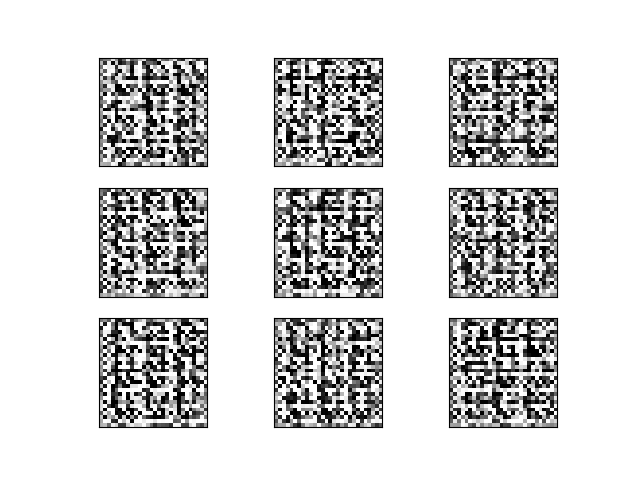

# DCGAN Implementation for MNIST dataset in C++ using PyTorch

This repository houses C++ code for training a DCGAN using the MNIST dataset.

We reference the DCGAN implementation documentation provided by the official <a href="https://pytorch.org/tutorials/advanced/cpp_frontend.html" target="_blank">PyTorch website</a>.



### Getting Started

Download the libtorch library based on your device specifications from here: https://pytorch.org/

Once the library is downloaded, copy the absolute path of the 'share/cmake/Torch' folder and run the following command in order (example absolute path is used):

```
mkdir checkpoints
mkdir build
cd build
cmake -DCMAKE_PREFIX_PATH=C:'/C++/example_app/libtorch/share/cmake/Torch'
cmake --build . --config Release
```

This will create an executable file at `build/Release/dcgan.exe`.

### Downloading the dataset

Download the dataset from here: https://www.kaggle.com/datasets/hojjatk/mnist-dataset

Once the dataset is downloaded, extract it in the `root` directory with the name `mnist` and remove all the folders inside it. Then, rename the `.idx{num}-ubyte` suffix to `-idx{num}-ubyte` suffix such that it matches with the torch library's filenaming specifications for MNIST.


### Run the script

Run the script as follows from the root folder (not the build folder).

```
build/Release/example-app
```

Note: To rebuild app after changes are made to dcgan.cpp, run the following from the root folder.

```
cmake --build build --config Release
build/Release/dcgan
```

### View sample generations after model is trained

Run the following Python file to view the sample generations for a given sample checkpoint:

```
python display-samples.py -i checkpoints/dcgan-sample-1.pt
```

Happy GAN-ing!
